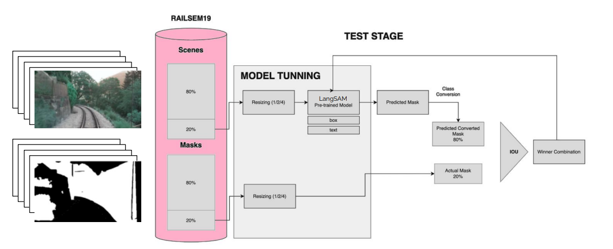
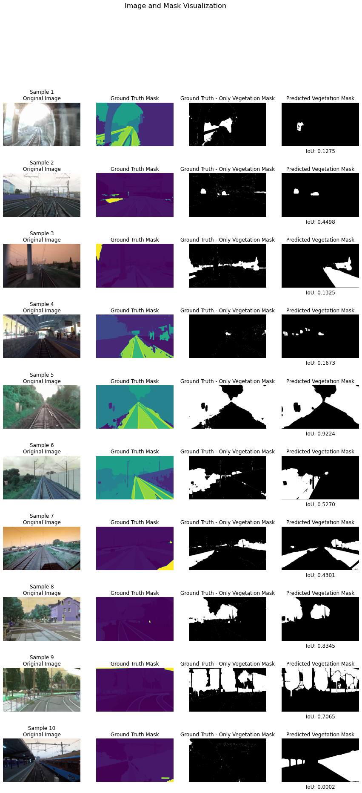
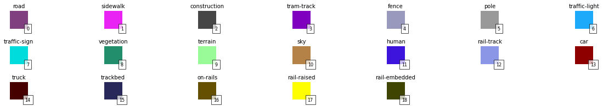
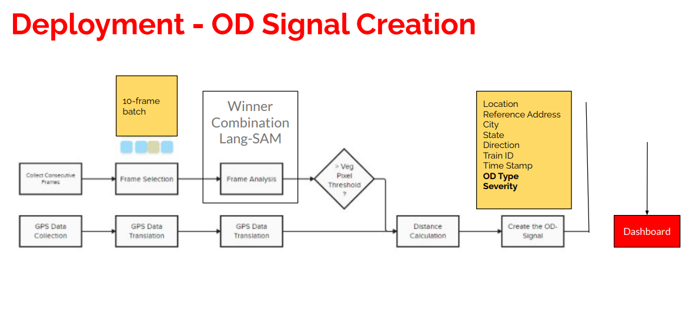
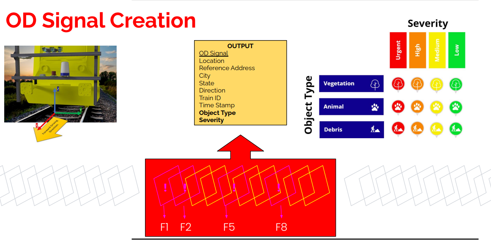

# RailSem19: Semantic Segmentation and Digital Twin for Railway Infrastructure

Exploratory analysis and semantic segmentation of the [RailSem19 dataset](https://www.wilddash.cc/railsem19), containing 8,500 ego-perspective railway images with pixel-wise annotations across 19 classes. The project was developed as part of a larger initiative to create a **digital twin of rail infrastructure** for vegetation monitoring, obstacle detection, and maintenance planning. It applies LangSAM zero-shot segmentation to explore and evaluate railway scene understanding.

## Project Overview

This project investigates how well existing segmentation models generalize to railway-specific scenes, with a focus on **vegetation segmentation** as part of a digital twin concept for a fictional railroad operator ("United Railroad"). The pipeline performs inference on RailSem19 validation images and compares predictions against the dataset's ground-truth masks using IoU evaluation.

After comparative evaluation of HRNet-W48 and LangSAM architectures, we selected **LangSAM (Language Segment Anything)** as our primary segmentation model. The decision was driven by LangSAM's text-image integration capability, which enables flexible class-specific mask generation without requiring retraining on the railway dataset.

The project also designed a conceptual **OD (Object Detection) Signal Creation pipeline** that processes 10-frame batches from train-mounted cameras, performs vegetation pixel threshold analysis, integrates GPS data for geolocation, and generates structured alert signals with object type and severity classification.

### Pipeline Architecture



**Figure 1**: End-to-end pipeline showing the RailSem19 dataset split (80/20 train/test), preprocessing steps (resizing at 1/2-1/4 scale), LangSAM model inference with text and bounding box prompts, predicted mask conversion, and IoU evaluation against ground truth annotations.

Key components:

- **Dataset Split**: 80% training / 20% validation following standard ML practice
- **Resizing Strategy**: Images resized to 1/2 or 1/4 original size to balance computational efficiency with detail preservation
- **Winner Combination Logic**: Aggregates predictions across multiple prompt variations for improved robustness

## Key Results

| Metric                                | Value             |
| ------------------------------------- | ----------------- |
| Average IoU (vegetation segmentation) | 0.62              |
| Mean pixel accuracy                   | 54.42%            |
| Median pixel accuracy                 | 51.70%            |
| Avg. processing time per image        | 1.69 min          |
| Image resizing strategy               | 1/2 original size |
| Train/test split                      | 80% / 20%         |

### Qualitative Results



**Figure 2**: Side-by-side comparison of original images, ground truth masks, vegetation-only ground truth extraction, and LangSAM predicted masks across 10 diverse RailSem19 validation samples. Each sample displays its corresponding Intersection over Union (IoU) score.

**Performance Observations**:

- **Best performing sample**: Sample 5 (IoU: 0.9224) - dense vegetation corridor with high contrast
- **Challenging conditions**: Samples 1, 3, 4 show lower IoUs (0.12-0.17) in tunnel/haze conditions with reduced visibility
- **Moderate success**: Samples 6-9 achieve IoUs between 0.43-0.83 in mixed urban/rural environments
- **Failure case**: Sample 10 (IoU: 0.0002) demonstrates complete prediction collapse, likely due to scene composition outside model's learned distribution

The wide performance variance (0.0002 to 0.9224) highlights the importance of domain-specific training data and suggests future work should focus on handling edge cases like extreme lighting conditions, occlusion, and rare scene compositions.

## Key Features

- **Dataset Exploration:** Visualization of RailSem19 images, semantic label maps, and color-coded ground-truth overlays across all 19 classes.
- **Class Distribution Analysis:** Statistical analysis of class frequencies, image resolutions, and per-class pixel coverage across all 8,500 images.
- **HRNet Inference:** Semantic segmentation using a pre-trained HRNet-W48 (CamVid) model loaded from TensorFlow Hub, with full post-processing (argmax decoding, color mapping, overlay blending).
- **LangSAM Zero-Shot Segmentation:** Text-prompted segmentation (e.g., "vegetation") using the Segment Anything Model with language grounding, enabling flexible class-specific mask generation without retraining.
- **IoU Evaluation:** Intersection over Union computation to quantitatively compare predicted masks against ground-truth annotations.
- **Multi-Dataset Testing:** LangSAM inference tested on both the RailSem19 subset and a secondary vegetation dataset to assess generalization.
- **OD Signal Pipeline (concept):** Designed a deployment architecture for real-time obstacle detection using 10-frame batches, GPS data integration, and severity-based alert generation.

## RailSem19 Classes



The dataset contains 19 semantic classes: road, sidewalk, construction, tram-track, fence, pole, traffic-light, traffic-sign, vegetation, terrain, sky, human, rail-track, car, truck, trackbed, on-rails, rail-raised, and rail-embedded.

## Conceptual Deployment Framework

Beyond offline evaluation, the project includes a designed architecture for real-time obstacle detection systems suitable for deployment on production trains.

### OD Signal Creation Pipeline



**Figure 3**: End-to-end deployment architecture processing 10-frame batches from train-mounted cameras. The pipeline performs vegetation pixel threshold analysis, integrates GPS data for geolocation, calculates distances, and generates structured OD (Obstacle Detection) signals with object type classification and severity ranking.

Pipeline stages:

1. **Frame Collection**: Consecutive frames buffered for temporal consistency
2. **GPS Translation**: Geospatial coordinates linked to visual observations
3. **LangSAM Analysis**: Winner combination logic selects optimal vegetation predictions
4. **Threshold Decision**: Vegetation pixel count triggers alert generation
5. **Signal Output**: Structured data packet containing location, severity, and object metadata

### Signal Specification



**Figure 4**: Detailed breakdown of the OD signal output schema showing three object categories (Vegetation, Animal, Debris), four-tier severity classification (Urgent, High, Medium, Low), and 10-frame batch processing logic (F1-F8 sampling windows).

Each OD signal contains:

- **Location Metadata**: Reference address, city, state, direction, train ID, timestamp
- **Object Classification**: Type (vegetation/animal/debris) with standardized icons
- **Severity Rating**: Color-coded urgency level determining maintenance priority
- **Spatial Context**: Distance calculations enable precise intervention planning

This conceptual framework connects your segmentation research to practical rail infrastructure maintenance workflows, demonstrating transferable value beyond academic evaluation.

## Repository Structure

```
Railsem19/
|
├── EDA_images.ipynb                          # Main notebook: EDA, HRNet inference, visualization
├── langSAM_modeling.ipynb                    # LangSAM batch inference on RailSem19 subset with IoU
├── langSAM_modeling_second_dataset.ipynb     # LangSAM on secondary vegetation dataset
|
├── example-vis.py                            # Dataset visualization utility script
├── rs19-config.json                          # Class-to-color mapping configuration
├── calibration.txt                           # Camera calibration parameters
|
├── license.md                                # License information
├── license.txt                               # License (text format)
└── README.md
```

### Dataset

The RailSem19 dataset is not included in this repository. You can request access from the official source: [wilddash.cc/railsem19](https://www.wilddash.cc/railsem19)

Once downloaded, place the data so the folder structure looks like:

```
jpgs/rs19_val/         # 8,500 JPEG images
uint8/rs19_val/        # Corresponding semantic label maps (grayscale)
rs19-config.json       # Class configuration (included in repo)
```

## Model Used

### LangSAM (Language Segment Anything)

An open-source project combining Meta's Segment Anything Model (SAM) with GroundingDINO for text-prompted instance segmentation. Selected as the primary model for vegetation segmentation due to its text-image synergy and adaptability to the RailSem19 dataset. The text prompt `"vegetation"` is used to generate vegetation masks, which are then compared against the RailSem19 ground-truth annotations (class 8) using IoU. Model parameters were customized to suit unique dataset characteristics including large image sizes and diverse scene conditions.

## Tech Stack

- **Frameworks:** TensorFlow 2.x, TensorFlow Hub, PyTorch
- **Segmentation Model:** LangSAM (SAM + GroundingDINO)
- **Libraries:** NumPy, OpenCV, Matplotlib, Pandas, PIL
- **Evaluation:** IoU (Intersection over Union), pixel accuracy
- **Project Management:** CRISP-DM, Agile/Scrum sprints, Jira

## License

This project is for academic and research purposes. The RailSem19 dataset is subject to its own licensing terms. See the [official dataset page](https://www.wilddash.cc/railsem19) for details.
